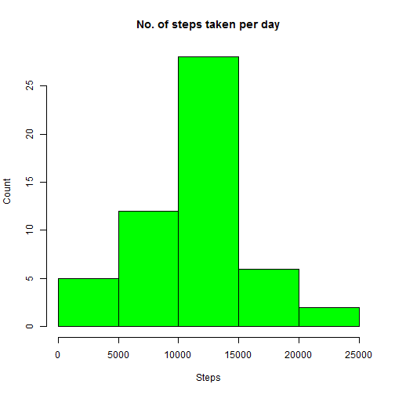
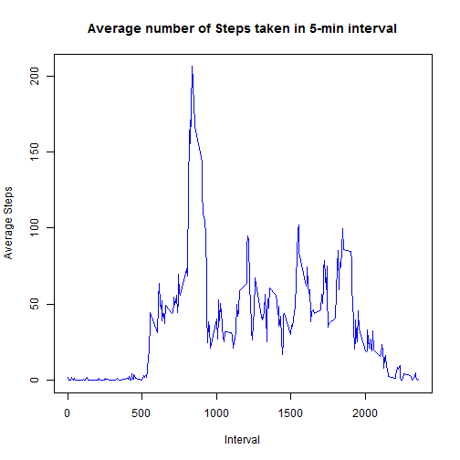
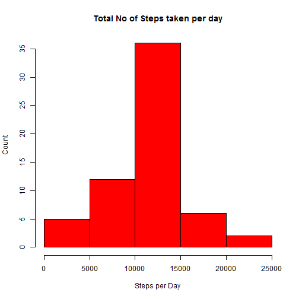

Dataset : Activity Monitoring Data

Reading th dataset and filtering all the rows not containing NA
Total no of Steps taken per day


```r
library(dplyr)
```

```
## 
## Attaching package: 'dplyr'
## 
## The following object is masked from 'package:stats':
## 
##     filter
## 
## The following objects are masked from 'package:base':
## 
##     intersect, setdiff, setequal, union
```

```r
activitydata <- read.csv("./activity.csv")
activityfilter <- filter(activitydata, !is.na(activitydata$steps))
groupactivitybydate <- group_by(activityfilter, date)
stepsperday <- summarize(groupactivitybydate, sum(steps))
head(stepsperday)
```

```
## Source: local data frame [6 x 2]
## 
##         date sum(steps)
## 1 2012-10-02        126
## 2 2012-10-03      11352
## 3 2012-10-04      12116
## 4 2012-10-05      13294
## 5 2012-10-06      15420
## 6 2012-10-07      11015
```

```r
names(stepsperday) <- c("Date", "Steps")
```

Histogram of total number of steps taken per Day:


```r
table(stepsperday$Steps)
```

```
## 
##    41   126  2492  3219  4472  5018  5441  6778  7047  7336  8334  8355 
##     1     1     1     1     1     1     1     1     1     1     1     1 
##  8821  8841  8918  9819  9900 10056 10119 10139 10183 10304 10395 10439 
##     1     1     1     1     1     1     1     1     1     1     1     1 
## 10571 10600 10765 11015 11162 11352 11458 11829 11834 12116 12426 12608 
##     1     1     1     1     1     1     1     1     1     1     1     1 
## 12787 12811 12883 13294 13452 13460 13646 14339 14478 15084 15098 15110 
##     1     1     1     1     1     1     1     1     1     1     1     1 
## 15414 15420 17382 20427 21194 
##     1     1     1     1     1
```

```r
hist(stepsperday$Steps,xlab = "Steps", ylab = "Count", main = "No. of steps taken per day", col = "green")
```

 

Mean and Median of total number of steps taken per day


```r
mean(stepsperday$Steps, na.rm = TRUE)
```

```
## [1] 10766.19
```

```r
median(stepsperday$Steps, na.rm = TRUE)
```

```
## [1] 10765
```


Time Series Plot of Average number of steps taken


```r
groupactivitybyinterval <- group_by(activityfilter, interval)
averagestepsbyinterval <- summarize(groupactivitybyinterval, sum(steps)/n())
names(averagestepsbyinterval) <- c("interval", "Average_Steps")
head(averagestepsbyinterval)
```

```
## Source: local data frame [6 x 2]
## 
##   interval Average_Steps
## 1        0     1.7169811
## 2        5     0.3396226
## 3       10     0.1320755
## 4       15     0.1509434
## 5       20     0.0754717
## 6       25     2.0943396
```

```r
 with(averagestepsbyinterval, plot(interval, Average_Steps, type = "l", xlab = "Interval", ylab = "Average Steps", main = "Average number of Steps taken in 5-min interval", col = "blue"))
```

 

```r
filter(averagestepsbyinterval, Average_Steps == max(averagestepsbyinterval$Average_Steps))
```

```
## Source: local data frame [1 x 2]
## 
##   interval Average_Steps
## 1      835      206.1698
```

Imputing Missing Values


```r
##Total number of missing values in a dataset
sum(is.na(activitydata$steps))
```

```
## [1] 2304
```

```r
##Strategy for filling all the missing values by mean of 5-min interval
meanstepsbyinterval <- summarize(groupactivitybyinterval, mean(steps))
names(meanstepsbyinterval) <- c("interval", "Mean_Steps")
fillNA <- numeric()
for(i in 1:nrow(activitydata))
  {
    obs <- activitydata[i, ]
    if(is.na(obs$steps))
      {
      steps <- subset(meanstepsbyinterval, interval == obs$interval)$Mean_Steps
      }
    else
      {
      steps <- obs$steps
    }
    fillNA[i] <- steps
  }
activitydatafillNA <- activitydata
activitydatafillNA$steps <- fillNA
head(activitydatafillNA)
```

```
##       steps       date interval
## 1 1.7169811 2012-10-01        0
## 2 0.3396226 2012-10-01        5
## 3 0.1320755 2012-10-01       10
## 4 0.1509434 2012-10-01       15
## 5 0.0754717 2012-10-01       20
## 6 2.0943396 2012-10-01       25
```

```r
##Histogram of total number of steps taken each day with mean and median
activitydatafillNAperday <- aggregate(steps ~ date, data = activitydatafillNA, FUN = sum)
hist(activitydatafillNAperday$steps, xlab = "Steps per Day", ylab = "Count", main = "Total No of Steps taken per day", col = "red")
```

 

```r
mean(activitydatafillNAperday$steps)
```

```
## [1] 10766.19
```

```r
median(activitydatafillNAperday$steps)
```

```
## [1] 10766.19
```
The estimate for the mean remain the same, However the estimate for median shifted a bit. For the days there was missing data has been replaced by mean of 5-min interval and the total no. of steps for each missing day is 10766.18.It increased th interval size of 10000-15000 by 8, since there were 8 missing days
